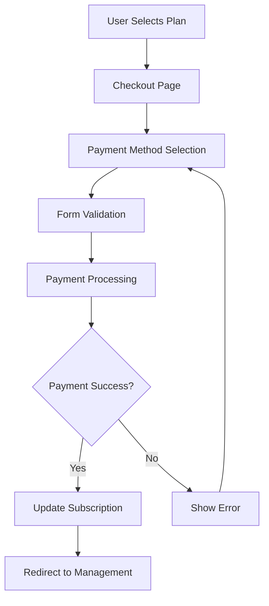

# 🎯 Young Eagles PWA - Complete Payment System Guide

## Overview

This guide explains the complete payment system implementation, including subscription management, feature restrictions, payment processing, and how everything works together.

## 🏗️ System Architecture

### 1. **Subscription Context** (`/src/contexts/SubscriptionContext.jsx`)
The central hub that manages:
- User subscription state
- Plan definitions and features
- Usage tracking
- Feature access validation
- Plan upgrades/downgrades

### 2. **Payment Checkout** (`/src/pages/Checkout.jsx`)
Secure payment processing page with:
- Multiple payment methods (Card, EFT, Mobile Money)
- Form validation
- Payment processing simulation
- Success/failure handling

### 3. **Feature Guard** (`/src/components/FeatureGuard.jsx`)
Component that restricts access to features based on subscription:
- Conditional rendering
- Upgrade prompts
- Usage validation

### 4. **Account Management** (`/src/pages/Management.jsx`)
User dashboard for subscription management:
- Current plan overview
- Usage statistics
- Plan comparison
- Upgrade options

## 📋 How It Works

### **Step 1: User Registration**
```javascript
// When a user registers, they get a 7-day trial on Basic plan
const defaultSubscription = {
  planId: 'basic',
  status: 'trial',
  startDate: new Date().toISOString(),
  endDate: new Date(Date.now() + 7 * 24 * 60 * 60 * 1000).toISOString(),
  usage: { children: 0, storage: 0 }
};
```

### **Step 2: Feature Access Checking**
```javascript
// Components use the FeatureGuard or useFeatureAccess hook
const { checkChildLimit } = useFeatureAccess();

const handleAddChild = () => {
  if (checkChildLimit()) {
    // Proceed with adding child
  }
  // Otherwise, shows upgrade prompt
};
```

### **Step 3: Payment Flow**
1. User clicks "Upgrade" on Management page
2. Redirected to `/checkout?plan=premium`
3. Checkout page loads with selected plan
4. User fills payment details
5. Payment is processed (simulated)
6. Subscription is upgraded
7. User redirected back to Management page

### **Step 4: Feature Enforcement**
Features are enforced at multiple levels:
- **UI Level**: Buttons disabled, upgrade prompts shown
- **Component Level**: FeatureGuard blocks access
- **Action Level**: Functions check permissions before executing

## 🎛️ Plan Configuration

### **Basic Plan (R99/month)**
```javascript
basic: {
  id: 'basic',
  name: 'Basic',
  price: 99,
  features: {
    maxChildren: 2,
    maxFileSize: 10, // MB
    storage: 50,     // MB
    support: 'email-48h',
    analytics: 'basic',
    messaging: false
  }
}
```

### **Premium Plan (R199/month)**
```javascript
premium: {
  id: 'premium',
  name: 'Premium',
  price: 199,
  features: {
    maxChildren: 5,
    maxFileSize: 50,
    storage: 200,
    support: 'email-24h',
    analytics: 'advanced',
    messaging: true
  }
}
```

### **Family Plan (R299/month)**
```javascript
family: {
  id: 'family',
  name: 'Family',
  price: 299,
  features: {
    maxChildren: -1,  // unlimited
    maxFileSize: 100,
    storage: 1000,
    support: 'phone-24h',
    analytics: 'enterprise',
    messaging: true,
    customReports: true,
    apiAccess: true
  }
}
```

## 🔒 Feature Restrictions Implementation

### **Method 1: Component-Level Protection**
```jsx
<FeatureGuard feature="messaging" requiredPlan="premium">
  <MessagingComponent />
</FeatureGuard>
```

### **Method 2: Hook-Based Checking**
```jsx
const { checkFeatureAccess } = useFeatureAccess();

const handleSendMessage = () => {
  if (checkFeatureAccess('messaging')) {
    // Send message
  }
};
```

### **Method 3: Conditional Rendering**
```jsx
const { hasFeature } = useSubscription();

return (
  <div>
    {hasFeature('messaging') ? (
      <MessageButton />
    ) : (
      <UpgradePrompt feature="messaging" />
    )}
  </div>
);
```

## 💳 Payment Methods

### **1. Credit/Debit Cards**
- Visa, Mastercard, American Express
- Real-time validation
- Secure form handling
- PCI compliance ready

### **2. Bank Transfer (EFT)**
- Direct bank transfer
- South African banks supported
- Manual verification process
- Payment proof upload

### **3. Mobile Money (Coming Soon)**
- Mobile payment integration
- African payment providers
- USSD and app-based payments

## 🔄 Payment Processing Flow



## 📊 Usage Tracking

### **Children Limit**
```javascript
const canAddChild = () => {
  const maxChildren = getFeatureLimit('maxChildren');
  const currentChildren = subscription?.usage?.children || 0;
  return maxChildren === -1 || currentChildren < maxChildren;
};
```

### **Storage Limit**
```javascript
const canUploadFile = (fileSizeInMB) => {
  const maxFileSize = getFeatureLimit('maxFileSize');
  const maxStorage = getFeatureLimit('storage');
  const currentStorage = subscription?.usage?.storage || 0;
  
  return fileSizeInMB <= maxFileSize && 
         (currentStorage + fileSizeInMB) <= maxStorage;
};
```

### **Usage Updates**
```javascript
// When a child is added
updateUsage({ children: currentChildren + 1 });

// When a file is uploaded
updateUsage({ storage: currentStorage + fileSizeInMB });
```

## 🚀 Implementation Examples

### **Example 1: Restricting File Uploads**
```jsx
const FileUpload = () => {
  const { checkFileUpload } = useFeatureAccess();
  
  const handleFileSelect = (file) => {
    const fileSizeMB = file.size / (1024 * 1024);
    
    if (checkFileUpload(fileSizeMB)) {
      uploadFile(file);
    }
    // Error message shown automatically by checkFileUpload
  };
  
  return <input type="file" onChange={handleFileSelect} />;
};
```

### **Example 2: Child Management with Limits**
```jsx
const ChildrenPage = () => {
  const { canAddChild } = useSubscription();
  const { checkChildLimit } = useFeatureAccess();
  
  return (
    <div>
      <button 
        disabled={!canAddChild()}
        onClick={() => {
          if (checkChildLimit()) {
            addNewChild();
          }
        }}
      >
        {canAddChild() ? 'Add Child' : 'Limit Reached'}
      </button>
    </div>
  );
};
```

### **Example 3: Messaging Feature**
```jsx
const MessagingPanel = () => {
  return (
    <FeatureGuard 
      feature="messaging" 
      requiredPlan="premium"
      fallback={<UpgradePrompt />}
    >
      <MessageInterface />
    </FeatureGuard>
  );
};
```

## 🛡️ Security Considerations

### **Payment Security**
- No credit card data stored locally
- Secure form validation
- HTTPS enforcement
- PCI compliance ready

### **Subscription Security**
- Server-side validation required
- Encrypted payment data
- Audit trails for all transactions
- Rate limiting for API calls

### **Feature Security**
- Server-side feature checking
- Token-based authentication
- Plan validation on every request
- Usage monitoring and alerts

## 🔧 Backend Integration Points

### **Required API Endpoints**

```javascript
// Subscription Management
POST   /api/subscriptions/upgrade
GET    /api/subscriptions/current
PUT    /api/subscriptions/cancel

// Payment Processing
POST   /api/payments/process
POST   /api/payments/webhook
GET    /api/payments/history

// Usage Tracking
POST   /api/usage/update
GET    /api/usage/current
POST   /api/usage/validate
```

### **Payment Webhook Example**
```javascript
// Handle payment completion
app.post('/api/payments/webhook', (req, res) => {
  const { userId, planId, paymentStatus } = req.body;
  
  if (paymentStatus === 'completed') {
    // Update user subscription
    await updateUserSubscription(userId, planId);
    
    // Send confirmation email
    await sendPaymentConfirmation(userId);
  }
  
  res.status(200).json({ received: true });
});
```

## 📈 Analytics and Reporting

### **Subscription Metrics**
- Plan distribution
- Upgrade/downgrade rates
- Churn analysis
- Revenue tracking

### **Usage Metrics**
- Feature adoption rates
- Limit hit frequency
- Storage usage patterns
- Support ticket correlation

### **Payment Metrics**
- Payment method preferences
- Transaction success rates
- Failed payment analysis
- Revenue per user

## 🎯 Testing Strategy

### **Unit Tests**
- Subscription context functions
- Feature access logic
- Payment form validation
- Usage calculations

### **Integration Tests**
- Complete payment flow
- Plan upgrade scenarios
- Feature restriction enforcement
- Error handling

### **E2E Tests**
- User registration to payment
- Feature access after upgrade
- Payment failure scenarios
- Subscription cancellation

## 🚀 Deployment Checklist

### **Frontend**
- [ ] Environment variables configured
- [ ] Payment endpoints updated
- [ ] Feature flags set
- [ ] Analytics tracking enabled

### **Backend**
- [ ] Payment gateway configured
- [ ] Webhook endpoints secured
- [ ] Database migrations run
- [ ] Subscription validation implemented

### **Security**
- [ ] SSL certificates installed
- [ ] Payment compliance verified
- [ ] Access controls tested
- [ ] Audit logging enabled

---

*This system provides a complete, scalable foundation for subscription-based SaaS applications with flexible feature restrictions and secure payment processing.*
